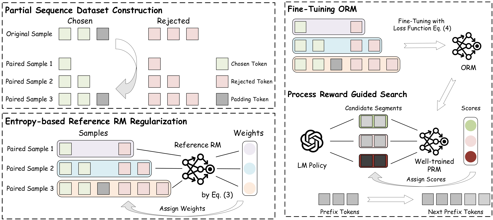

# SP-PRM
<p align="center">
  <a href="https://arxiv.org/abs/2503.03746"> 📃 Paper</a> |  
  <a href="https://weepcat.github.io/"> 📭 Contact</a> 
</p>

## Accepted by ACL 2025 (Main).

## Introduction
This repository shares the code and data of our latest work "From Outcomes to Processes: Guiding PRM Learning from ORM for Inference-Time Alignment".




## Installation

To set up the project locally, please follow the instructions below:

1. Clone the repository:

   ```sh
   git clone https://github.com/xiebin23/SP-PRM.git
   cd SP-PRM
   ```

2. Create and activate a virtual environment:

   ```sh
   conda create -n sp_prm python=3.10
   conda activate sp_prm
   ```

3. Install the required dependencies:
   ```sh
   pip install transformers trl datasets
   ```

## Example

After setting up the environment, you can run the experiments and analysis scripts as follows:

1. **Data Construction:**

   ```sh
   python partial_data_construct/hh_data_process_partial.py
   ```

2. **Reward Modeling:**

   ```sh
   python reward_modeling/hh_base_model_sft.py
   python reward_modeling/hh_partial_reward_model_with_weights.py
   ```

3. **Baselines:**

   ```sh
   python generation/hh_collect_baseline_results.py
   ```

4. **Evaluation:**
   ```sh
   python evaluation/hh_baseline_results_evaluate_by_rm.py
   python evaluation/hh_baseline_results_evaluate_by_gpt.py
   python evaluation/hh_baseline_results_evaluate_by_diversity.py
   python evaluation/hh_baseline_results_evaluate_by_coherence.py
   ```

## Citation
If you find this repository helpful, feel free to cite our paper.

```bibtex
@inproceedings{xie-etal-2025-outcomes,
    title = "From Outcomes to Processes: Guiding {PRM} Learning from {ORM} for Inference-Time Alignment",
    author = "Xie, Bin and Xu, Bingbing  and Yuan, Yige  and Zhu, Shengmao and Shen, Huawei",
    year = "2025",
    booktitle = "Proceedings of the 63rd Annual Meeting of the Association for Computational Linguistics (Volume 1: Long Papers)",
    month = jul,
    year = "2025",
    address = "Vienna, Austria",
    publisher = "Association for Computational Linguistics",
    url = "https://aclanthology.org/2025.acl-long.946/",
    doi = "10.18653/v1/2025.acl-long.946",
    pages = "19291--19307",
    ISBN = "979-8-89176-251-0",
}
```
